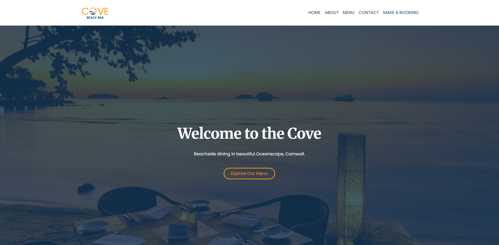
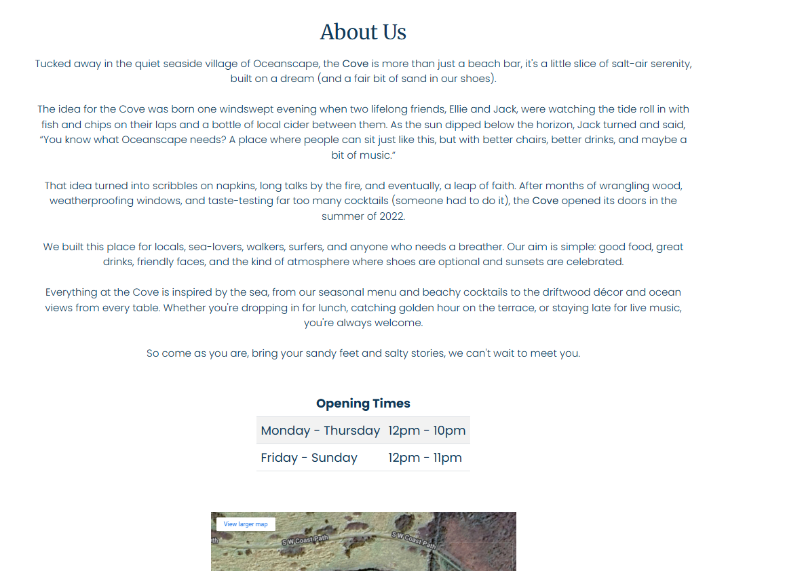
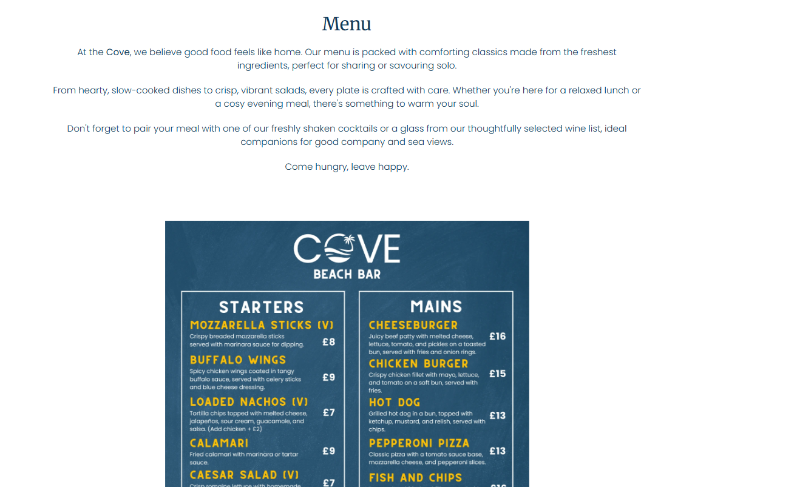
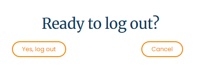
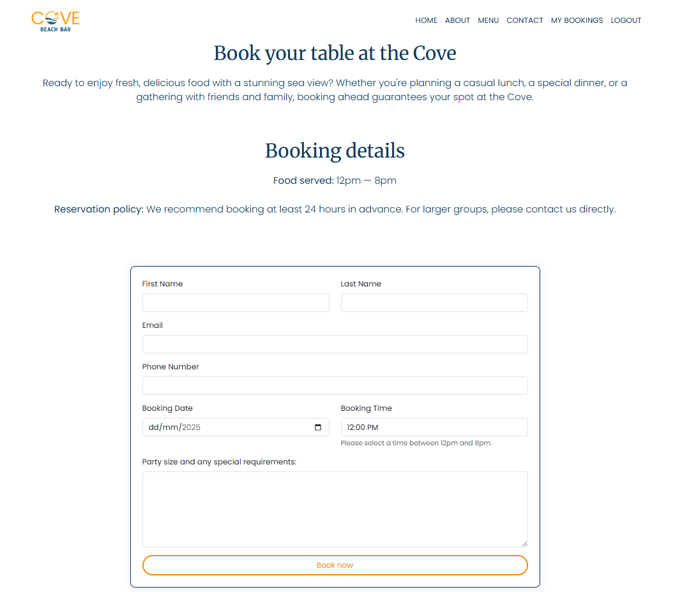

# Milestone Project 3 - Cove Beach Bar

# Table of Contents

1. [Project description](#project-description)
2. [User Experience (UX)](#user-experience-ux)
3. [User stories](#user-stories)
4. [Design choices](#design-choices)
5. [Wireframes](#wireframes)
6. [Entity Relationship](#entity-relationship)
7. [Features](#features)
8. [Tools and technologies](#tools-and-technologies)
9. [Testing](#testing)
10. [Deployment](#deployment)
11. [Credits](#credits)

## Project description

This project is designed for Unit 3: Back-End Development, where the goal is to build a full-stack web application with server-side functionality. For this project, I have developed the Cove, a beach bar reservation system that allows users to make a reservation. The system features a user-friendly front end connected to a PostgreSQL database via a Django back end, deployed live on Heroku.

The application allows visitors to create, view, update, and delete their bookings, while also providing admin access for managing all reservations. This project is focused on applying the principles of back-end development including database integration and form validation.

The core focus of this project is to demonstrate the practical use of back-end frameworks, showcasing my ability to build a functional, secure, and maintainable web application with real-world use cases.

[Return to Table of Contents](#table-of-contents)

## User experience (UX)

The Cove is a beach bar and restaurant that requires a website so visitors and regular customers can view the menu, make table bookings, and manage their reservations easily.

### Owners Goals

As a **Cove administrator**, I can **manage all bookings** so that **customer reservations are organized and conflicts avoided.**

- A page listing all bookings with customer and booking details.
- Options to add, edit, or cancel any booking.
- Confirmation prompts before deletion or changes.

As a **Cove administrator**, I can **can control user access** so that **only authorised staff can manage bookings and data.**

- Secure admin login system.

### Site user Goals

As a **site user**, I can **view the homepage and navigation** so that **I can easily explore the site and find information.**

- A welcoming homepage with key info.
- Clear navigation bar with links to menu, bookings, contact, and login pages.
- Responsive layout for mobile and desktop.

As a **site user**, I can **create an account** so that **I can make and manage bookings.**

- A sign up page with a simple signup form.

As a **logged-in user**, I can **log into my account** so that **I can access my bookings.**

- A “Login” page for email/username and password input.

As a **logged-in user**, I can **make a booking** so that **I can reserve a table at the Cove.**

- A booking form requiring date, time, and message entry for number of guests and requirements.
- Form validation to prevent empty or invalid submissions.

As a **logged-in user**, I can **view, edit, or cancel my bookings** so that **I can manage my plans.**

- A “My Bookings” page listing current reservations.
- Buttons to edit or cancel bookings.
- Confirmation prompts before cancellations or changes.

As a **logged-in user**, I can **log out securely** so that **my session ends properly.**

- A logout button that ends the session and redirects to the homepage.

### User stories

You can view all user stories for this project on the GitHub project board [here.](https://github.com/users/naomihunt25/projects/8)

[Return to Table of Contents](#table-of-contents)

## Design choices

For The Cove, I aimed to create a clean, coastal-inspired design that reflects the calm, welcoming vibe of a beach bar at sunset. The layout is simple and user-friendly, allowing visitors to focus on key content like menus and booking options. The white background paired with deep blue and burnt orange accents evokes the feeling of ocean waves meeting warm evening skies—subtly reminiscent of a seaside sunset.

### Typography choices

**Primary Font:** Poppins
Poppins was chosen for headings and buttons due to its modern, rounded style that gives a fresh, contemporary feel. Its clean geometry makes the site look polished and professional while still being approachable.

**Secondary Font:** Merriweather
Merriweather was selected for paragraph text to add a classic touch that contrasts gently with the modern look of Poppins. It improves readability on longer texts like booking instructions and menu descriptions, offering balance and elegance.

### Colour palette

The color scheme captures the beach bar’s identity with a coastal twist: #113859, a deep nautical blue, reflects the ocean and adds a sense of calm and reliability; #f38b10, a rich burnt orange, brings warmth and energy inspired by golden sunset hues over the sea; and #ffffff, a clean white, is used for backgrounds and text contrast to ensure clarity and maintain a fresh, airy aesthetic. Together, these colours balance the coolness of the sea with the warmth of a summer evening, setting the perfect tone for the Cove’s relaxed yet vibrant atmosphere.

[Return to Table of Contents](#table-of-contents)

## Wireframes

The wireframes below outline the intended layout for the Cove website.

### Home page design

### About page design

### Menu page design

### Contact page design

### Login page design

### Logout page design

### Sign up page design

### New booking page design

### Booking success page design

### Error page design

[Return to Table of Contents](#table-of-contents)

## Entity Relationship

During the project planning phase, I created Entity Relationship Diagrams to visualise the database structure and model relationships.

[Return to Table of Contents](#table-of-contents)

## Features

### Home page

The home page acts as the welcoming gateway to the Cove website, designed to immediately convey the relaxed, coastal atmosphere while providing easy navigation to key sections:

- Inviting design: Clean layout with ocean-inspired colors and sunset accents to create a warm, beachside vibe.

- User-friendly navigation: Clear calls to action guide visitors to explore the menu, make bookings, or contact the Cove.

- Responsive layout: Optimised for desktop, tablet, and mobile users to ensure a seamless browsing experience across all devices.

### About page

The About page shares the story behind the Cove, building a connection with visitors through engaging content and visuals:

- Storytelling focus: Highlights the beach bar’s heritage and atmosphere, creating a sense of place and authenticity.

- Location details: Map and address information for easy navigation.

### Menu page

The Menu page provides a clear and attractive display of food and drink options:

- Organised presentation: Easy-to-read categories and descriptions help visitors browse offerings effortlessly.

### Contact page

The Contact page offers visitors multiple ways to get in touch or find the Cove:

- Contact form: Simple and accessible form for enquiries or feedback.

- Social media links: Connects users to the Cove’s online community.

### User account pages (Login, Logout, Sign Up)

These pages support user account management for bookings and personalised experiences:

- Secure authentication: Clear forms for users to log in or create accounts safely.

- User feedback: Confirmation messages and error handling to guide users smoothly through account processes.

### Booking system page

The booking feature streamlines table reservations to improve customer experience and management:

- New booking page: User-friendly form to select date, time, and party size.
  

- Booking success page: Confirmation screen reassuring users their reservation is confirmed.
  

- Error handling: Helpful messages for invalid or incomplete booking attempts.

### Error Pages

The error pages handles unexpected situations gracefully to maintain a good user experience even when things go wrong, both error pages are designed to be simple, helpful, and consistent with the Cove’s style:

- 404 Error: Displays a clear message when a user tries to access a page that doesn’t exist, helping them understand the link is broken or the page has been moved. It also provides easy navigation back to the homepage or other main sections.
  

- 500 Error: Shows a user-friendly message if there’s a server issue or something went wrong internally, reassuring users that the problem is being addressed and guiding them back to the home page.
  

### Future features

- Live table availability system: Integrate a real-time table availability feature so users can instantly see which time slots are free before making a booking.

- Email & SMS booking Cconfirmations: Automatically send confirmation messages and booking reminders via email or text to improve communication and reduce no-shows.

- Dynamic menu management: Enable staff to update food and drink menus through a simple admin panel, allowing for seasonal or daily specials to be displayed in real time.

  [Return to Table of Contents](#table-of-contents)

## Tools and technologies

- HTML5 – Used to build the structure and content of the site.
- CSS3 – Applied to style the pages with the coastal theme of The Cove.
- Python – Powers the backend logic of the booking system using Django.
- Django – Used to build and manage the full-stack web application, including user authentication and database handling.

### Python packages and dependencies

- asgiref==3.8.1
- dj-database-url==0.5.0
- gunicorn==20.1.0
- oauthlib==3.2.2
- psycopg==3.2.9
- psycopg2==2.9.10 and psycopg2-binary==2.9.10
- sqlparse==0.5.3
- typing_extensions==4.14.0
- tzdata==2025.2
- urllib3==2.4.0
- whitenoise==6.8.2

### Tools

- Balsamiq – Used to create low-fidelity wireframes for planning the layout and structure of each page in a clear, user-focused way.
- Canva – Designed visual assets such as the logo, custom menu graphics, database diagrams, and other imagery to reflect the beachside vibe of the Cove.
- Favicon.io – Used to generate a custom favicon, adding a personalised and polished touch to the browser tab.
- Google Chrome DevTools – Assisted with inspecting elements, fixing layout issues, and testing responsiveness during development.
- Git & GitHub – Provided version control throughout the development process, and served as the project’s remote code repository.
- Heroku – Used to deploy the Django application and PostgreSQL database, making the project accessible as a live website.

[Return to Table of Contents](#table-of-contents)

## Testing

Please refer to the [TESTING.md](TESTING.md) file for all testing-related information.

[Return to Table of Contents](#table-of-contents)

## Deployment

**Heroku deployment**

1. From your GitPod CLI in the project's root directory, execute: pip3 freeze --local > requirements.txt to generate a requirements file with all project dependencies.
2. Create a new file named Procfile (with capital 'P') in your Gitpod workspace root directory. Open the Procfile and verify it contains web: python3 app.py, then save.
3. Commit and push both new files to your GitHub repository
4. Access Heroku, click "Create new app", enter your application name and select your nearest region.
5. Go to the Deploy section in your Heroku dashboard, choose GitHub as the deployment method, locate your repository and click 'connect'.
6. Access the Settings tab, click "Reveal Config Vars" and add the following variables:

| Key          | Value       |
| ------------ | ----------- |
| DATABASE_URL | postgresql  |
| SECRET_KEY   | mysecretkey |

_Note: Actual environment variable values have been omitted for security purposes._

**Fork the respository**

1. Log in to [Gitpod](https://gitpod.io/), head over to [naomihunt25/the-cove repository](https://github.com/naomihunt25/the-cove).
2. Locate the Fork button at the top-right of the page.
3. Add a description for your fork.
4. Click Create Fork to finish to create a copy.

**Clone the repository**

1. On the [naomihunt25/the-cove repository](https://github.com/naomihunt25/the-cove), click Code (above list of files).
2. Click the local tab.
3. Copy the HTTPS link from the "Clone with HTTPS" section.
4. Launch Git Bash
5. Navigate to your desired directory location for the cloned repository.
6. Enter git clone followed by the copied URL from Step 3.
7. Hit Enter to create your local copy.

Live link - [Cove](https://the-cove-e90a3e902fab.herokuapp.com/)

[Return to Table of Contents](#table-of-contents)

### Credits

#### Content

I implemented the site's core components like buttons and modals using Bootstrap. When I encountered HTML and CSS concepts I wasn't familiar with during development, I referenced W3Schools to strengthen my understanding and guide implementation.

### Fonts

I selected my primary and secondary fonts through Fontjoy and sourced both typefaces from Google Fonts.

### Media

#### Icons

I created a custom favicon using favicon.io.

#### Images

I sourced the hero image from Canva and also used the platform to create mockups, logos, and database schema diagrams. For wireframing, I utilised Balsamiq software.

[Return to Table of Contents](#table-of-contents)
