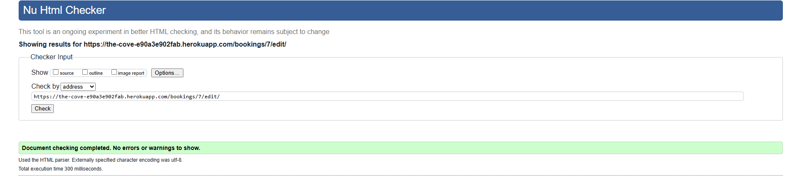

# Testing

Return back to [README.md](README.md) file.

# Table of Contents

- [Code validation](#code-validation)
- [Tested browsers](#tested-browsers)
- [Lighthouse audit](#lighthouse-audit)
- [Manual testing](#manual-testing)
- [User story testing](#user-story-testing)
- [Fixed bugs](#fixed-bugs)

## Code validation

### HTML Validation

All pages have been validated using the W3C Markup Validation Service and contain no errors or warnings that affect site functionality.

### Home page


### About page


### Menu page


### Contact page


### Contact success page


### Login page


### Logout page


### Sign up page


### New booking page


### Booking success page


### My bookings page


### Edit bookings page



### 404 page


### 500 page


### CSS Validation

I validated all of my CSS files using the recommended W3C Jigsaw CSS Validator, and they passed without any errors.


### Python Validation

I used the recommended PEP8 CI Python Linter to ensure that all my Python files adhere to proper coding style standards.

## Validation for 'thecove' files

| File name   | Screenshot                                                                      | Notes                                             |
| ----------- | ------------------------------------------------------------------------------- | ------------------------------------------------- |
| asgi.py     |          | Pass                                              |
| settings.py |  | Messsage: AUTH_PASSWORD_VALIDATORS lines too long |
| urls.py     |          | Pass                                              |
| wsgi.py     |          | Pass                                              |

---

## Validation for 'bookings' files

| File name | Screenshot                                                                   | Notes |
| --------- | ---------------------------------------------------------------------------- | ----- |
| admin.py  |    | Pass  |
| apps.py   |      | Pass  |
| forms.py  |    | Pass  |
| models.py |  | Pass  |
| urls.py   |      | Pass  |
| views.py  |    | Pass  |

[Return to Table of Contents](#table-of-contents)

## Tested browsers

I tested my deployed project across multiple browsers to ensure compatibility.

### Chrome


### Firefox


### Edge


[Return to Table of Contents](#table-of-contents)

## Device responsiveness

I tested my deployed project on various devices to verify its responsiveness.

### Mobile - Used Chrome DevTools


### Tablet - Used Chrome DevTools


[Return to Table of Contents](#table-of-contents)

## Lighthouse audit

I used the Lighthouse Audit tool to evaluate my deployed project and identify any significant issues.

### Home page


### About page

Scored lower on Best Practices due to using Google Maps to embed.


### Menu page


### Contact page


### Login page


### Logout page


### Sign up page


### New booking page


### My bookings page


### 404 page


### 500 page


[Return to Table of Contents](#table-of-contents)

## Manual testing

| Feature/Test                                  | Expected Behaviour                                                   | Result |
| --------------------------------------------- | -------------------------------------------------------------------- | ------ |
| **Logo in Navbar**                            | Clicking logo redirects to the homepage                              | Pass   |
| **Navigation Links** (Home, About, Menu, etc) | Each link takes the user to the correct page                         | Pass   |
| **Navbar on Mobile**                          | Navbar collapses into a hamburger menu with working links            | Pass   |
| **Footer Social Links**                       | Clicking opens the link in a new browser tab                         | Pass   |
| **Login Button**                              | Takes the user to the login page                                     | Pass   |
| **Login Form – empty fields**                 | Prevents submission and shows required field messages                | Pass   |
| **Login – wrong username**                    | Displays error message for invalid user                              | Pass   |
| **Login – wrong password**                    | Displays error message for incorrect password                        | Pass   |
| **Login – correct details**                   | Logs user in and redirects to "My Bookings"                          | Pass   |
| **Navbar after login**                        | Updates to show “My Bookings” and “Sign Out”, removes Login/Register | Pass   |
| **Register link on Login Page**               | Redirects user to the registration page                              | Pass   |
| **Registration – empty fields**               | Submission blocked with form error messages                          | Pass   |
| **Registration – username/email exists**      | Prevents submission and shows appropriate error message              | Pass   |
| **Registration – valid new user**             | Creates new account and redirects with login prompt                  | Pass   |
| **Login link on Login Page**                  | Redirects back to login page                                         | Pass   |
| **Logout button**                             | Logs user out and redirects to homepage                              | Pass   |
| **Logout Confirmation**                       | Modal appears to confirm logout action                               | Pass   |
| **“My Bookings” Link (logged in)**            | Opens user’s bookings page                                           | Pass   |
| **“My Bookings” Link (logged out)**           | Redirects to login page                                              | Pass   |
| **My Bookings – Edit Button**                 | Opens edit form with existing booking info pre-filled                | Pass   |
| **My Bookings – Delete Button**               | Triggers a modal to confirm deletion before proceeding               | Pass   |
| **Booking Form – empty**                      | Submission blocked and shows error messages                          | Pass   |
| **Booking Form – logged out**                 | Redirects to login page                                              | Pass   |
| **Booking Form – valid input**                | Saves booking and redirects to “My Bookings” with confirmation       | Pass   |
| **Edit Booking Form – fields pre-filled**     | Displays current booking info in form fields                         | Pass   |
| **Edit Booking – empty fields**               | Submission blocked with validation messages                          | Pass   |
| **Edit Booking – valid update**               | Saves changes and redirects to “My Bookings” with message            | Pass   |
| **Access Edit Booking (logged out)**          | Redirects to login or shows error                                    | Pass   |
| **Invalid URL entered**                       | Loads custom 404 error page                                          | Pass   |
| **404 Page – Home button**                    | Redirects back to the homepage                                       | Pass   |
| **Server Error Triggered**                    | Loads custom 500 error page                                          | Pass   |
| **500 Page – Home button**                    | Redirects to the homepage                                            | Pass   |

[Return to Table of Contents](#table-of-contents)

## User story testing

| **User Story** | **Screenshot** |
|----------------|----------------|
| As a site user, I want to view the homepage and navigate the site so that I can find important information. |  |
| As a site user, I want to create an account so that I can make and manage bookings. |  |
| As a logged-in user, I want to log into my account so that I can access my bookings. |  |
| As a logged-in user, I want to make a booking so that I can reserve a table at The Cove. |  |
| As a logged-in user, I want to view, edit, or cancel my bookings so that I can manage my plans. |  |
| As a logged-in user, I want to log out securely so that my session ends properly. |  |
| As a Cove administrator, I want to manage all bookings so that customer reservations are organised and conflicts avoided. |  |

[Return to Table of Contents](#table-of-contents)

## Fixed bugs

### Bug 1

Fixed correct parth to bookings url.<br><br>
_Original code_:<br>

```py
path('success/', views.booking_success, name='booking_success'),
path('<int:pk>/', views.booking_detail, name='booking_detail'),
```

_New code_:<br>

```py
path('bookings/success/', views.booking_success, name='booking_success'),
path('bookings/<int:pk>/', views.booking_detail, name='booking_detail'),
```

### Bug 2

Correctly save booking instance with logged-in user.<br><br>
_Original code_:<br>

```py
form.save()
```

_New code_:<br>

```py
booking.save()
```

### Bug 3

Restrict booking list to show only user's bookings if not staff.<br><br>
_Original code_:<br>

```py
bookings = Booking.objects.all().order_by('-booking_date', '-booking_time')
```

_New code_:<br>

```py
bookings = Booking.objects.filter(user=request.user).order_by('-booking_date', '-booking_time')
```

[Return to Table of Contents](#table-of-contents)
